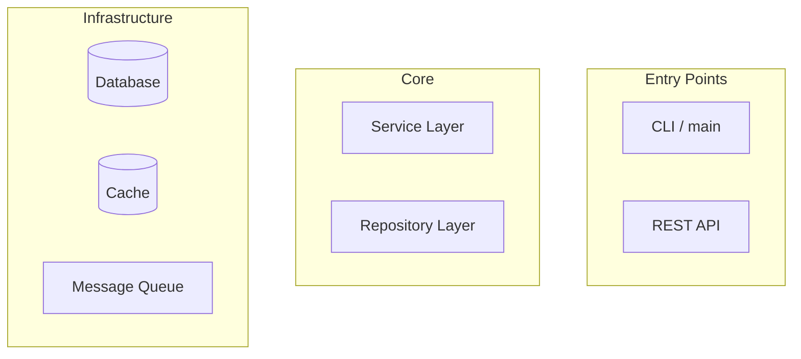

# Code Wiki — Auto-Generate Documentation & Diagrams

Analyze a codebase and produce structured documentation with Mermaid
architecture diagrams. Use this when asked to "document the codebase",
"generate docs for this project", "explain the architecture", or
"create a wiki for this repo".

## When to Use

- "document this project" / "generate docs"
- "explain the architecture"
- "what does this codebase look like?"
- "create a wiki entry for module X"

## Process

### Phase 1 — Scan & Map

1. Use `codebase-inspection` to discover structure (LOC, languages, ratios)
2. Use `ls` and `glob` to map directory layout
3. Identify entry points (main.go, index.ts, __init__.py, etc.)
4. Find config files, build scripts, test directories

### Phase 2 — Generate Architecture Diagram

Use `canvas` tool with Mermaid:

Include in the diagram:
- Module relationships and dependencies
- Data flow direction
- External dependencies (APIs, databases)
- Key interfaces and abstractions

### Phase 3 — Write Module Documentation

For each major module/directory, produce:
1. **Purpose:** What problem does this module solve?
2. **Key Types/Functions:** The public API surface
3. **Dependencies:** What it imports and what imports it
4. **Patterns:** Design patterns used, conventions followed
5. **Gotchas:** Edge cases, known limitations, workarounds

### Phase 4 — Write Development Guide

Document the developer workflow:
1. **Setup:** clone, install deps, configure env
2. **Build:** compile steps, output locations
3. **Test:** run suites, coverage expectations
4. **Run:** entry points, flags, environment vars
5. **Contribute:** PR conventions, review expectations

### Phase 5 — Output

Format the output as structured markdown. Write to `docs/` directory:
- `docs/ARCHITECTURE.md` — architecture diagram + module map
- `docs/MODULES.md` — per-module documentation
- `docs/DEVELOPMENT.md` — developer guide
- `docs/README.md` — index linking to all documents

Preserve existing documentation — only add new files, never overwrite without asking.
